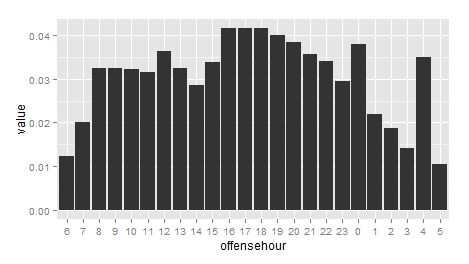

Crimes per Hour in Dallas 2014
------------------------------

**Author: Justin Nafe**
**Date: Saturday, January 04, 2015**

Introduction
------------

This analysis uses Dallas Open Data (<a href="https://www.dallasopendata.com/" target="_blank">https://www.dallasopendata.com/</a>) to calculate the number of crimes per zip code in Dallas County. As pointed out on Dallas Police Public Data website (<a href="http://www.dallaspolice.net/publicdata/" target="_blank">http://www.dallaspolice.net/publicdata/</a>), the data that the police supply to the public is sample data, so the data cannot be used to supply official statistics.

Getting Started
---------------

Required packages:
```
library(lubridate)
library(dplyr)
library(ggplot2)
```

Run crimeAnalysisByHour.R from an R console.

crimeAnalysisByHour.R gets the crime data from dallasopendata.com.

Disclaimer: The data supplied by Dallas Police Department is sampled and should not be used for statistical purposes, but we should be able to get an idea of when crimes are committed.

The Dallas Police Department implemented a new Records Management System (RMS) on June 1, 2014. To get crime data for 2014, two datasets are needed.

The resulting dataset is in the shape of a normal distribution.


